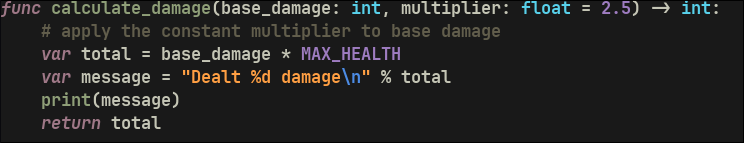
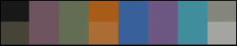

# evening-in-kyoto-nvim

A [Neovim](https://neovim.io) colorscheme: Evening in Kyoto, a
protanomaly-calibrated terminal theme inspired by Monokai Soda. 

## Disclaimer

Keep in mind that 'inspired by' in this case means 'I see it as similar', due to only seeing RED at about 30% saturation of what a normal vision would see. 

For example, someone with this particularity would not distinguish bright green from yellow, or brown from dark green... or light pink from gray (which teens tend to notice, at least when I was in high-school :) )

## Example


## Shifts from Monokai Soda
 Monokai Soda

 Evening in Kyoto


Take this with a grain of salt, as AI was telling me what the colours' families were.

- Red channel: pink to dusty rose
- Green channel: lime green to sage
- Yellow channel: left orange but changed bright to amber 
- Blue channel: violet to light navy
- Magenta channel: was same as red, changed to low brightness violet


## Install

With [lazy.nvim](https://github.com/folke/lazy.nvim):

```lua
{
  url = "https://github.com/cosminoance/evening-in-kyoto-nvim",
  lazy = false,
  priority = 1000,
  config = function()
    vim.cmd.colorscheme 'evening_in_kyoto'
  end,
}
```

`url` is spelled out explicitly (rather than the shorter `"user/repo"` shorthand) so it's easy to repoint if this ever moves off GitHub.

Without a plugin manager: clone this repo and add it to your
runtimepath directly:

```lua
vim.opt.rtp:prepend '/path/to/evening-in-kyoto-nvim'
vim.cmd.colorscheme 'evening_in_kyoto'
```

## Configuration

Transparent background (lets a terminal's own opacity, e.g. WezTerm's
`window_background_opacity`, show through the empty canvas — buffer body,
floats, gutters — while syntax colors, `Search`/`Visual`, statusline, and
popup menus stay fully opaque). Off by default; existing setups are
unaffected.

Set the default before `:colorscheme` runs:

```lua
vim.g.evening_in_kyoto_transparent = true
vim.cmd.colorscheme 'evening_in_kyoto'
```

Toggle it at runtime from command-line mode, no setup required:

```
:lua require('evening_in_kyoto').toggle_transparent()
```

Optionally, bind that call to a key of your choosing:

```lua
vim.keymap.set('n', '<leader>tt', require('evening_in_kyoto').toggle_transparent, { desc = '[T]oggle [T]ransparency' })
```

## What's covered

Core syntax (`Comment`/`String`/`Function`/etc.), Treesitter `@`-captures,
LSP semantic tokens, diagnostics, and: `blink.cmp`, `mini.nvim`,
`telescope.nvim`, `gitsigns.nvim`, `which-key.nvim`, `mason.nvim`,
`fidget.nvim`, `todo-comments.nvim`. Also sets Neovim's `:terminal` ANSI
colors to match the palette.

Everything applies eagerly on `:colorscheme` load -- no lazy-plugin-trigger
system. A lazy-loaded plugin just needs its highlight groups added to
`lua/evening_in_kyoto/highlights.lua`; Neovim only reads a group's
highlight when it's actually referenced.

Not covered (add to `highlights.lua` if you use one of these):
neo-tree, nvim-tree, indent-blankline, bufferline, dashboard, noice,
notify, toggleterm.

## Extending

Add or edit entries in `lua/evening_in_kyoto/highlights.lua`'s
returned table -- a plain `group_name -> vim.api.keyset.highlight` map, no
framework. Group names come from `:help highlight-groups`,
`:help treesitter-highlight-groups`, `:help lsp-highlight`,
`:help diagnostic-highlights`, or the target plugin's own `:help`/README.
